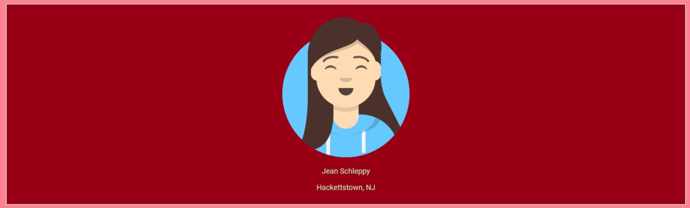

# About me Project final draft
# Hello! My name is Jean Schleppy, and I am a beginner web developer.

### Status badge: 

### Description: The purpose of this project was to learn the basics of how to build a website for all devices while making sure it is accessible to everyone. Some of the skills that I learned for this project was how to include links in the navigation bar, how to put images in the webpage, how to contrast colors so that it is accessible to all viewers and how to adjust the content on the webpage so that it is positioned properly.

### Color Scheme: There are two major color schemes in this project. The background color for this project is *#FF8294*; with the text color as *#000037*;. This was done so that there was enough contrast between the two colors to make the webpage accessible to all viewers. 

### Citations:
**https://color.adobe.com/create/color-wheel**
**https://www.w3schools.com/css/css_link.asp**
**https://www.sessions.edu/color-calculator/**
**https://www.favicon-generator.org/**
**https://www.1001fonts.com/heavy+google-web-fonts.html?page=1&items=50**
**https://www.figma.com/**
**https://www.w3schools.com/howto/howto_js_mobile_navbar.asp**

### Blog sources:
**https://www.axis-praxis.org/specimens/__DEFAULT__**
**https://web.dev/variable-fonts/**
**https://developer.mozilla.org/en-US/docs/Web/CSS/CSS_Fonts/Variable_Fonts_Guide**

### Licenses or copyrights: The type of license I wish to release content to is a permissive license. The copyright for this webpage is listed in the footer at the bottom of the page.

